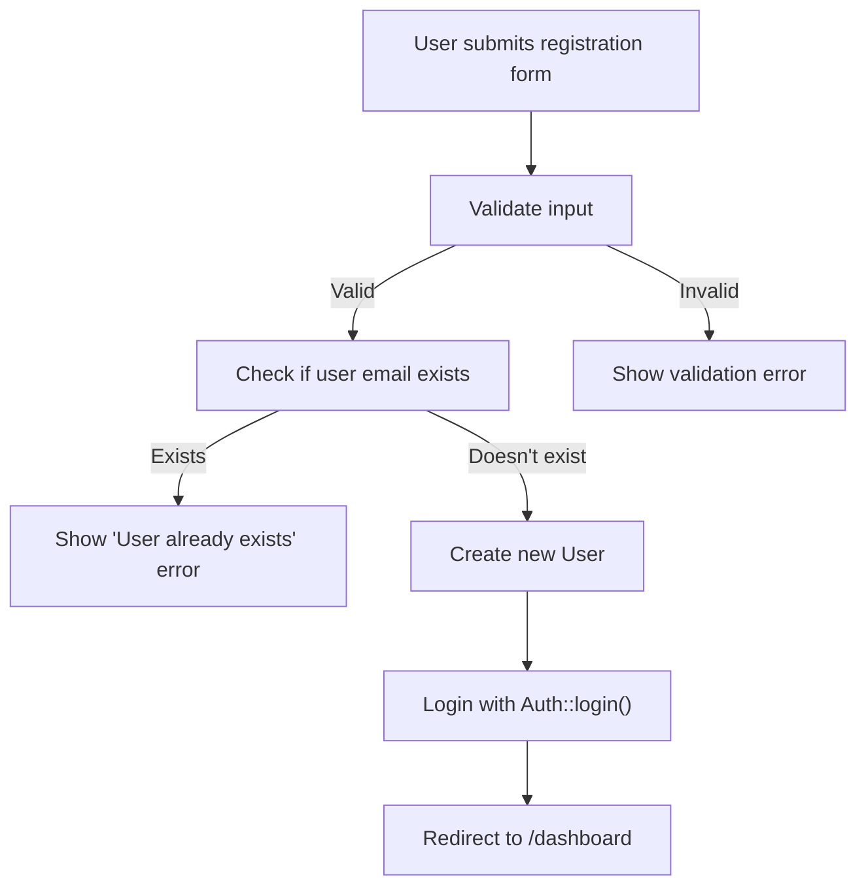

# Index page

[a relative link](dir1/dir1file1.md)

```mermaid
flowchart TD
    A["User submits registration form"] --> B["Validate input"]
    B -->|Valid| C["Check if user email exists"]
    B -->|Invalid| Z["Show validation error"]

    C -->|Exists| Y["Show 'User already exists' error"]
    C -->|Doesn't exist| D["Create new User"]

    D --> E["Login with Auth::login()"]
    E --> F["Redirect to /dashboard"]
```